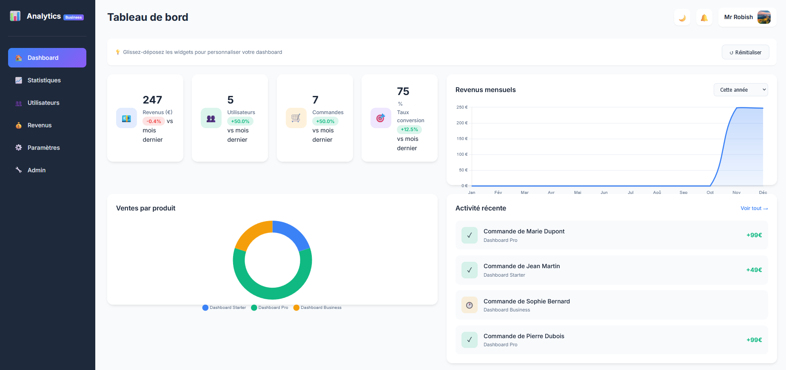

# 📊 Dashboard Analytics Pro

Un tableau de bord analytique moderne et complet, prêt à l'emploi. Idéal pour suivre vos ventes, revenus, utilisateurs et performances.



---

## ✨ Fonctionnalités

- 📈 **6 pages complètes** — Dashboard, Statistiques, Utilisateurs, Revenus, Paramètres, Admin
- 🌙 **Mode clair/sombre** — Changez de thème en un clic
- 🎨 **5 couleurs personnalisables** — Adaptez l'interface à votre marque
- 📦 **Panneau Admin** — Gérez commandes, utilisateurs et produits
- 📊 **Graphiques interactifs** — Visualisez vos données avec Chart.js
- 🔔 **Notifications** — Soyez alerté des nouvelles commandes
- 💾 **Export/Import** — Sauvegardez et restaurez vos données
- 🖱️ **Drag & Drop** — Réorganisez les widgets du dashboard
- 📱 **Responsive** — Fonctionne sur desktop, tablette et mobile
- ⚡ **100% Frontend** — Pas de serveur requis, hébergement gratuit possible

---

## 🚀 Installation

### Option 1 — Ouvrir directement

1. Téléchargez et décompressez le fichier ZIP
2. Ouvrez le fichier `index.html` dans votre navigateur
3. C'est prêt ! 🎉

### Option 2 — Hébergement gratuit (GitHub Pages)

1. Créez un compte sur [GitHub](https://github.com)
2. Créez un nouveau repository
3. Uploadez tous les fichiers du projet
4. Allez dans **Settings** → **Pages**
5. Sélectionnez la branche `main` et cliquez **Save**
6. Votre dashboard est en ligne ! 🌐

### Option 3 — Hébergement gratuit (Netlify)

1. Allez sur [Netlify](https://netlify.com)
2. Glissez-déposez votre dossier de projet
3. C'est en ligne en 30 secondes ! 🚀

---

## 📁 Structure des fichiers
```
dashboard-analytics-pro/
├── index.html      # Page principale
├── style.css       # Styles CSS
├── script.js       # Logique JavaScript
├── config.js       # Configuration personnalisable
└── README.md       # Ce fichier
```

---

## ⚙️ Personnalisation

### Modifier les informations de l'application

Ouvrez le fichier `config.js` et modifiez :
```javascript
const CONFIG = {
    app: {
        name: 'VotreApp',      // Nom de votre application
        badge: 'PRO',           // Badge affiché
        logo: '📊'              // Emoji ou icône
    },
    user: {
        name: 'Votre Nom',
        avatar: 'V'
    }
};
```

### Modifier les couleurs

Allez dans **Paramètres** → **Apparence** et choisissez parmi les 5 couleurs disponibles.

### Ajouter vos données

1. Allez dans **Admin**
2. Ajoutez vos **produits**
3. Ajoutez vos **commandes**
4. Ajoutez vos **utilisateurs**
5. Les statistiques se calculent automatiquement ! 📊

---

## 💾 Sauvegarde des données

Les données sont stockées dans le navigateur (localStorage).

**Pour sauvegarder :**
1. Allez dans **Paramètres** → **Sauvegarde**
2. Cliquez sur **Exporter**
3. Un fichier JSON est téléchargé

**Pour restaurer :**
1. Allez dans **Paramètres** → **Sauvegarde**
2. Cliquez sur **Importer**
3. Sélectionnez votre fichier JSON

---

## 🛠️ Technologies utilisées

- **HTML5** — Structure
- **CSS3** — Design moderne avec variables CSS
- **JavaScript** — Logique et interactivité
- **Chart.js** — Graphiques interactifs
- **LocalStorage** — Stockage des données

---

## 📝 Licence

Ce produit est vendu sous licence personnelle. Vous pouvez l'utiliser pour vos propres projets, mais pas le revendre.

---

## 💬 Support

Des questions ? Contactez-moi à : olirobz31@gmail.com

---

Fait avec ❤️ par Mr Robish